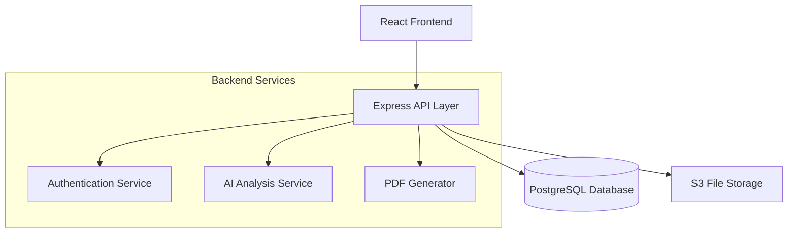

# Design Document

## Overview

The AI-Based Reverse Engineering System is a full-stack web application that guides users through an 11-step workflow to analyze competitor pumps and generate improved product concepts. The system combines structured data collection, file management, AI-powered analysis, and comprehensive reporting capabilities.

**Key Characteristics:**
- Sequential workflow with state management and validation
- Multi-step forms with automatic data persistence
- AI-driven analysis and suggestion generation
- PDF report generation with compiled multi-step data
- Role-based access control (users vs. managers)

## Architecture

### System Architecture



**Architecture Pattern:** Three-tier architecture (Presentation, Application, Data)

**Deployment Model:** Containerized services (Docker) with cloud storage integration

### Technology Stack

**Frontend:**
- React 18+ for UI components and state management
- React Router for navigation
- Axios for API communication
- Form validation library (React Hook Form or Formik)
- UI component library (Material-UI or Ant Design)

**Backend:**
- Node.js 18+ with Express 4.x
- JWT for authentication
- Multer for file upload handling
- Winston for logging
- Jest for testing

**Database:**
- PostgreSQL 15+ for relational data storage
- Connection pooling via pg-pool

**File Storage:**
- AWS S3 (or compatible service like MinIO) for images, CAD files, PDFs
- Presigned URLs for secure file access

**AI Integration:**
- OpenAI API or similar LLM service
- Separate AI service module for analysis logic
- Retry logic and timeout handling

**PDF Generation:**
- PDFKit or Puppeteer for report generation
- Template-based rendering

## Components and Interfaces

### Frontend Components

**1. Dashboard Component**
- Displays paginated project list (20 per page)
- Project cards with: ID, name, creation date, current step, status
- Create, view, edit, delete project actions
- Filter and search functionality

**2. Workflow Stepper Component**
- Visual progress indicator (steps 1-11)
- Step status: completed, current, upcoming, locked
- Navigation between completed steps
- Step validation before progression

**3. Step Form Components (11 total)**

**Step 1 - Product Selection:**
- Form fields: name, model, manufacturer, category, supplier info, market data
- Multi-image upload (max 10, PNG/JPEG/JPG, 10MB each)
- Validation: required fields

**Step 2 - Teardown Documentation:**
- Component list manager (max 500 components)
- Per-component: part ID (50 chars), photos (max 10, 10MB each)
- Assembly sequence editor (ordered steps with descriptions)
- Validation: min 1 component with 1 photo

**Step 3 - Measurements:**
- Measurement entry per component from Step 2
- Numeric input: 0.001-99999.999mm, 3 decimal places
- CAD file upload (STEP/IGES/STL, 100MB max)
- Geometry data: shape type, tolerances
- Validation: min 1 measurement per component

**Step 4 - Material Identification:**
- Material fields per component: casting, shaft, impeller, fasteners
- Text input (100 chars max per field)
- Validation: min 1 material specified

**Step 5 - Performance Benchmarking:**
- Numeric fields: head (0-1000m), discharge (0-100000 LPM), efficiency (0-100%), power (0-1000000W)
- 2 decimal places
- Validation: all 4 fields required

**Step 6 - Cost Breakdown:**
- BOM cost per component (2 decimals, 0-999,999,999.99)
- Cost fields: manufacturing, assembly, logistics
- Calculated total cost display
- Validation: all costs entered

**Step 7 - AI Design Evaluation:**
- "Analyze" button trigger
- Loading indicator during analysis (60s timeout)
- Display: improvement opportunities, cost reductions, reliability suggestions, manufacturability improvements
- Auto-save analysis results

**Step 8 - Value Engineering:**
- "Generate Suggestions" button trigger
- Display: material alternatives (1-10), design alternatives (1-10), process improvements (1-10)
- Each suggestion includes cost comparison and performance metrics
- Loading indicator (60s timeout)

**Step 9 - New Product Concept:**
- Selection interface: checkboxes for improvements from Steps 7 & 8
- "Generate Concept" button
- Display: design description, specifications, feature improvements
- Loading indicator (60s timeout)

**Step 10 - Management Review:**
- Display concept from Step 9
- Action buttons: Approve, Rework Required, Reject
- Feedback text area (1000 chars) for Rework/Reject
- Status update and routing logic

**Step 11 - Final Report:**
- "Generate Report" button
- Compilation of Steps 1-10 (300s timeout)
- Download button for PDF
- Report contents: cost comparison, performance comparison, improvement summary, images, data tables, AI outputs

**4. Authentication Components**
- Login form
- Session management
- Unauthorized redirect

### Backend API Endpoints

**Authentication:**
- `POST /api/auth/login` - User login
- `POST /api/auth/logout` - User logout
- `GET /api/auth/session` - Verify session

**Projects:**
- `GET /api/projects?page=1&limit=20` - List projects (paginated)
- `POST /api/projects` - Create project
- `GET /api/projects/:id` - Get project details
- `PUT /api/projects/:id` - Update project (name, notes)
- `DELETE /api/projects/:id` - Delete project

**Workflow Steps (generic pattern):**
- `GET /api/projects/:projectId/steps/:stepNumber` - Get step data
- `POST /api/projects/:projectId/steps/:stepNumber` - Save/update step data
- `PUT /api/projects/:projectId/steps/:stepNumber/complete` - Mark step complete

**File Upload:**
- `POST /api/files/upload` - Upload file to S3, return URL
- `DELETE /api/files/:fileId` - Delete file from S3

**AI Analysis:**
- `POST /api/ai/evaluate-design/:projectId` - Trigger Step 7 analysis
- `POST /api/ai/value-engineering/:projectId` - Trigger Step 8 suggestions
- `POST /api/ai/generate-concept/:projectId` - Trigger Step 9 concept generation
- All return job ID, poll for results or use webhooks

**Reports:**
- `POST /api/reports/generate/:projectId` - Generate PDF report
- `GET /api/reports/:reportId/download` - Download PDF

**Management Review:**
- `POST /api/projects/:projectId/review` - Submit review decision (approve/rework/reject)

### AI Analysis Service Interface

**Input:** Project data from Steps 1-6 (JSON)

**Step 7 - Design Evaluation Output:**
```json
{
  "improvementOpportunities": [
    {"description": "...", "priority": "high|medium|low"}
  ],
  "costReductions": [
    {"description": "...", "estimatedSavings": 1234.56}
  ],
  "reliabilityImprovements": [
    {"component": "...", "suggestion": "..."}
  ],
  "manufacturabilityImprovements": [
    {"description": "...", "complexity": "..."}
  ]
}
```

**Step 8 - Value Engineering Output:**
```json
{
  "materialAlternatives": [
    {"current": "...", "alternative": "...", "costDiff": -123.45, "performanceMetrics": {...}}
  ],
  "designAlternatives": [...],
  "processImprovements": [...]
}
```

**Step 9 - Concept Generation Output:**
```json
{
  "designDescription": "...",
  "specifications": {...},
  "featureImprovements": ["..."]
}
```

**Timeout:** 60 seconds per analysis call
**Retry Strategy:** 3 retries with exponential backoff

## Data Models

### Core Entities

**Users**
```sql
CREATE TABLE users (
  id SERIAL PRIMARY KEY,
  username VARCHAR(255) UNIQUE NOT NULL,
  password_hash VARCHAR(255) NOT NULL,
  role VARCHAR(50) NOT NULL, -- 'user' or 'manager'
  created_at TIMESTAMP DEFAULT NOW()
);
```

**Projects**
```sql
CREATE TABLE projects (
  id SERIAL PRIMARY KEY,
  user_id INTEGER REFERENCES users(id) ON DELETE CASCADE,
  name VARCHAR(255) NOT NULL,
  notes TEXT,
  status VARCHAR(50) DEFAULT 'in_progress', -- 'in_progress', 'approved', 'rejected'
  current_step INTEGER DEFAULT 1,
  created_at TIMESTAMP DEFAULT NOW(),
  updated_at TIMESTAMP DEFAULT NOW()
);
```

**WorkflowSteps**
```sql
CREATE TABLE workflow_steps (
  id SERIAL PRIMARY KEY,
  project_id INTEGER REFERENCES projects(id) ON DELETE CASCADE,
  step_number INTEGER NOT NULL,
  status VARCHAR(50) DEFAULT 'incomplete', -- 'incomplete', 'complete'
  data JSONB, -- Step-specific data stored as JSON
  completed_at TIMESTAMP,
  UNIQUE(project_id, step_number)
);
```

**Components** (from Step 2)
```sql
CREATE TABLE components (
  id SERIAL PRIMARY KEY,
  project_id INTEGER REFERENCES projects(id) ON DELETE CASCADE,
  part_id VARCHAR(50) NOT NULL,
  photo_urls TEXT[], -- Array of S3 URLs
  assembly_position INTEGER,
  created_at TIMESTAMP DEFAULT NOW()
);
```

**Measurements** (from Step 3)
```sql
CREATE TABLE measurements (
  id SERIAL PRIMARY KEY,
  component_id INTEGER REFERENCES components(id) ON DELETE CASCADE,
  measurement_type VARCHAR(100),
  value DECIMAL(10, 3), -- millimeters
  unit VARCHAR(20) DEFAULT 'mm',
  cad_file_url TEXT,
  geometry_data JSONB
);
```

**Materials** (from Step 4)
```sql
CREATE TABLE materials (
  id SERIAL PRIMARY KEY,
  component_id INTEGER REFERENCES components(id) ON DELETE CASCADE,
  material_type VARCHAR(100), -- 'casting', 'shaft', 'impeller', 'fastener'
  material_name VARCHAR(100)
);
```

**PerformanceData** (from Step 5)
```sql
CREATE TABLE performance_data (
  id SERIAL PRIMARY KEY,
  project_id INTEGER REFERENCES projects(id) ON DELETE CASCADE,
  head DECIMAL(10, 2), -- meters
  discharge DECIMAL(10, 2), -- LPM
  efficiency DECIMAL(5, 2), -- percentage
  power_consumption DECIMAL(10, 2) -- watts
);
```

**CostData** (from Step 6)
```sql
CREATE TABLE cost_data (
  id SERIAL PRIMARY KEY,
  project_id INTEGER REFERENCES projects(id) ON DELETE CASCADE,
  component_id INTEGER REFERENCES components(id),
  bom_cost DECIMAL(12, 2),
  manufacturing_cost DECIMAL(12, 2),
  assembly_cost DECIMAL(12, 2),
  logistics_cost DECIMAL(12, 2),
  total_cost DECIMAL(12, 2)
);
```

**AIAnalysis** (Steps 7, 8, 9)
```sql
CREATE TABLE ai_analysis (
  id SERIAL PRIMARY KEY,
  project_id INTEGER REFERENCES projects(id) ON DELETE CASCADE,
  step_number INTEGER NOT NULL,
  analysis_type VARCHAR(50), -- 'design_evaluation', 'value_engineering', 'concept_generation'
  input_data JSONB,
  output_data JSONB,
  status VARCHAR(50), -- 'pending', 'completed', 'failed'
  executed_at TIMESTAMP DEFAULT NOW()
);
```

**ManagementReviews** (Step 10)
```sql
CREATE TABLE management_reviews (
  id SERIAL PRIMARY KEY,
  project_id INTEGER REFERENCES projects(id) ON DELETE CASCADE,
  decision VARCHAR(50) NOT NULL, -- 'approved', 'rework_required', 'rejected'
  feedback TEXT,
  reviewer_id INTEGER REFERENCES users(id),
  reviewed_at TIMESTAMP DEFAULT NOW()
);
```

**Reports** (Step 11)
```sql
CREATE TABLE reports (
  id SERIAL PRIMARY KEY,
  project_id INTEGER REFERENCES projects(id) ON DELETE CASCADE,
  pdf_url TEXT NOT NULL,
  generated_at TIMESTAMP DEFAULT NOW()
);
```

**Files** (tracking uploads)
```sql
CREATE TABLE files (
  id SERIAL PRIMARY KEY,
  project_id INTEGER REFERENCES projects(id) ON DELETE CASCADE,
  file_name VARCHAR(255),
  file_type VARCHAR(50), -- 'image', 'cad', 'pdf'
  file_size BIGINT, -- bytes
  s3_url TEXT NOT NULL,
  uploaded_at TIMESTAMP DEFAULT NOW()
);
```

### Relationships

- Users → Projects (1:many)
- Projects → WorkflowSteps (1:many)
- Projects → Components (1:many)
- Components → Measurements (1:many)
- Components → Materials (1:many)
- Projects → PerformanceData (1:1)
- Projects → CostData (1:many via components)
- Projects → AIAnalysis (1:many)
- Projects → ManagementReviews (1:many)
- Projects → Reports (1:many)
- Projects → Files (1:many)

## Error Handling

### Frontend Error Handling

**Validation Errors:**
- Display inline field-level errors within 1 second
- Highlight invalid fields with red borders
- Show specific error messages below fields
- Disable submit/complete buttons while errors exist

**Network Errors:**
- Catch Axios request failures
- Display toast/snackbar notifications for connection issues
- Provide retry buttons for failed operations
- Fallback to local storage for unsaved data

**File Upload Errors:**
- Validate file size and format client-side before upload
- Display progress indicators during upload
- Show specific error messages for format/size violations
- Allow immediate retry

**AI Analysis Errors:**
- 60-second timeout for AI operations
- Display spinner during processing
- Show error messages for timeouts or failures
- Re-enable "Analyze" buttons for retry
- Do not enable step completion on failure

### Backend Error Handling

**API Error Responses:**
```json
{
  "error": {
    "code": "VALIDATION_ERROR",
    "message": "Human-readable error message",
    "details": {
      "field": "description of issue"
    }
  }
}
```

**HTTP Status Codes:**
- 400: Bad Request (validation errors)
- 401: Unauthorized (authentication required)
- 403: Forbidden (insufficient permissions)
- 404: Not Found (resource does not exist)
- 408: Request Timeout (AI analysis timeout)
- 413: Payload Too Large (file size exceeded)
- 422: Unprocessable Entity (invalid data format)
- 500: Internal Server Error (unexpected failures)
- 503: Service Unavailable (AI service down)

**Database Error Handling:**
- Wrap database operations in try-catch blocks
- Log errors with Winston
- Return generic error messages to client (avoid exposing schema details)
- Implement transaction rollback for multi-step operations

**File Storage Error Handling:**
- Validate S3 connectivity before upload
- Retry uploads up to 3 times with exponential backoff
- Clean up partial uploads on failure
- Return presigned URL errors as 503 responses

**AI Service Error Handling:**
- Set 60-second timeout on API calls
- Retry up to 3 times with exponential backoff (2s, 4s, 8s)
- Log input/output for debugging
- Return structured error responses indicating failure type (timeout, invalid input, service unavailable)

### Data Persistence and Recovery

**Auto-save Strategy:**
- Trigger save 5 seconds after last user interaction
- Store step data in `workflow_steps.data` JSONB field
- Retry failed saves up to 3 times (2s intervals)
- Fallback to browser localStorage on exhausted retries
- Display warning to user if all saves fail

**Session Recovery:**
- Store session token in httpOnly cookie
- Track last request timestamp server-side
- 30-minute inactivity timeout
- Redirect to login on expired session
- Restore project state on re-login

**Data Integrity:**
- Verify required fields before marking step complete
- Foreign key constraints enforce referential integrity
- Validate data types and ranges server-side
- Log all state transitions for audit trail

## Testing Strategy

### Unit Testing

**Frontend Unit Tests:**
- Component rendering tests (React Testing Library)
- Form validation logic tests
- State management tests
- Utility function tests
- Target: 80% code coverage

**Backend Unit Tests:**
- API endpoint tests (supertest)
- Database model tests (mock database)
- Validation logic tests
- Authentication/authorization tests
- File upload handler tests
- Target: 80% code coverage

**Key Test Scenarios:**
- Validate numeric inputs with ranges and decimal constraints
- Validate file uploads with size/format checks
- Validate step completion prerequisites
- Validate workflow state transitions
- Validate cost calculations
- Validate authentication flows

### Integration Testing

**API Integration Tests:**
- Full request/response cycles for all endpoints
- Database persistence verification
- File upload to S3 integration
- AI service integration (mocked for tests)
- Authentication middleware integration

**End-to-End Workflow Tests:**
- Complete workflow from Step 1 to Step 11
- Project creation → data entry → AI analysis → report generation
- Management review approval/rejection flows
- Session timeout and recovery

**Key Integration Scenarios:**
- Multi-step data dependencies (Step 3 requires Step 2 components)
- AI analysis with real or mocked AI service
- PDF generation with compiled data
- File upload and retrieval from S3
- Auto-save and data recovery

### Error Scenario Testing

**Network Failures:**
- API timeout handling
- Retry logic verification
- Offline fallback behavior

**File Upload Failures:**
- Oversized file rejection
- Unsupported format rejection
- S3 connectivity failures

**AI Service Failures:**
- Timeout handling (60s)
- Invalid response handling
- Service unavailability handling

**Validation Failures:**
- Missing required fields
- Out-of-range numeric values
- Excess character limits
- Invalid file formats

### Performance Testing

**Load Testing:**
- Concurrent user sessions (target: 100 users)
- Large file uploads (up to 100MB CAD files)
- Database query performance with 1000+ projects
- PDF generation time (target: <300s)

**Response Time Targets:**
- API responses: <500ms (non-AI endpoints)
- AI analysis: <60s
- File upload: <10s per 10MB
- PDF generation: <300s
- Auto-save: <5s

### Testing Tools

- **Jest** - Unit tests (frontend and backend)
- **React Testing Library** - Frontend component tests
- **Supertest** - Backend API tests
- **Cypress or Playwright** - E2E tests
- **JMeter or k6** - Load testing

---

## Implementation Notes

**Phase 1: Core Infrastructure**
1. Database schema and migrations
2. Authentication system
3. Basic CRUD APIs for projects
4. File upload to S3
5. Frontend routing and dashboard

**Phase 2: Workflow Steps 1-6**
6. Step form components (data collection)
7. Workflow state management
8. Auto-save implementation
9. Validation logic

**Phase 3: AI Integration**
10. AI service module
11. Steps 7-9 AI endpoints
12. Retry and timeout handling

**Phase 4: Review and Reporting**
13. Management review workflow (Step 10)
14. PDF generation (Step 11)
15. Email notifications (optional)

**Phase 5: Polish and Optimization**
16. Error handling refinement
17. Performance optimization
18. Comprehensive testing
19. Documentation

**Security Considerations:**
- Use parameterized queries to prevent SQL injection
- Validate and sanitize all user inputs
- Implement rate limiting on API endpoints
- Use HTTPS for all communications
- Store passwords with bcrypt (cost factor 12+)
- Implement CSRF protection
- Set secure httpOnly cookies for sessions
- Validate file uploads (magic bytes, not just extensions)
- Implement role-based access control (RBAC)
- Audit log for sensitive operations

**Scalability Considerations:**
- Database connection pooling
- S3 for distributed file storage
- Horizontal scaling of API servers (stateless design)
- Caching layer (Redis) for session data and frequent queries
- Message queue (RabbitMQ, SQS) for AI analysis jobs
- CDN for static assets

---

*This design provides the technical foundation for implementing the AI-Based Reverse Engineering System. The architecture prioritizes data integrity, user experience, and scalability while maintaining simplicity in the core workflow.*
